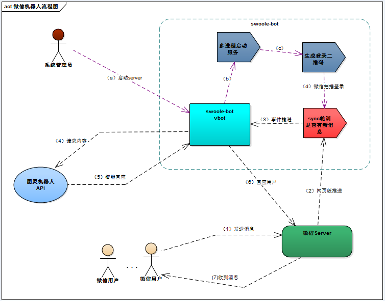

## 1. 简介

* 项目原理: 模拟微信网页版登录,如果网页版本没有的功能，这个项目项目也是无能为力的
* 该项目主要目的想利用swoole，增强原生PHP cli的能力，默认是daemon的守护进程模式
* 直接使用hanson/vbot库，swoole-bot只是增加swoole版本的入口,这样有利用新功能迭代
* 已经支持多用户登录，修改src/config.php 的workNum可以控制默认启动进程数
* 自动监控子进程，意外退出后会自动恢复，保证服务稳定性

### 1.1 流程图


## 2. 安装

### 2.1环境要求

* PHP >= 7.0
* swoole >= 1.8.9
* vbot >= 2.0

### 2.2 安装方式


* composer

```
composer require kcloze/swoole-bot
```

* git

```
git clone https://github.com/kcloze/swoole-bot.git
cd swoole-bot
composer install
```

### 2.3 修改配置项
* tulingKey必须配置，[需要先注册图灵机器人信息](http://www.tuling123.com/help/h_cent_webapi.jhtml?nav=doc)

### 2.4 管理服务


``` 

php run.php start|stop

``` 


## 3. 体验demo
* 微信添加微信好友：ysrg2014
* 输入验证关键字：666
* 对话输入自己想说的话，微信机器人机会跟您聊天了


## 4. 文档

* [vbot文档](http://create.hanc.cc/vbot/docs/)
* [图灵机器人文档](http://www.tuling123.com/help/h_cent_webapi.jhtml?nav=doc)


## 5. 参考项目

[hanson/vbot](https://github.com/HanSon/vbot)


## 6. 感谢

* [hanson/vbot](https://github.com/HanSon/vbot)
* [swoole](http://www.swoole.com/)
* [图灵机器人](http://www.tuling123.com/)

## 7. QQ群
* 141059677
