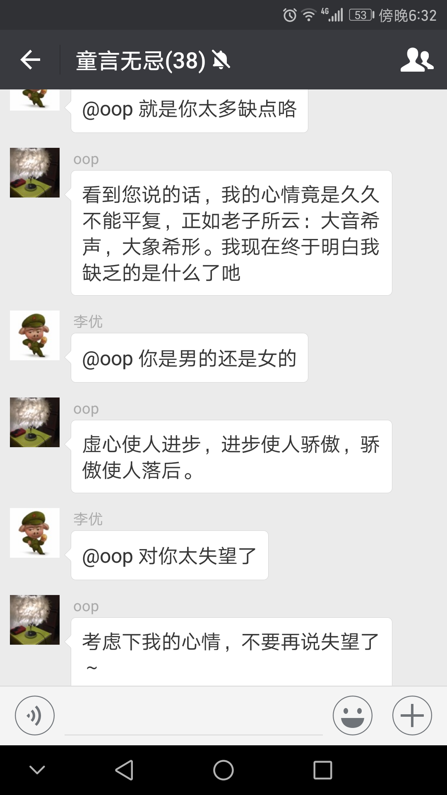

## 安装

### 环境要求

* PHP >= 7.0
* swoole >= 1.8.9

### 安装


1. composer

```
composer require kcloze/swoole-bot
```

2. git

```
git clone https://github.com/kcloze/swoole-bot.git
cd swoole-bot
composer install
```

然后执行

``` 
chmod u+x server.sh
./server.sh start|stop|restart

``` 
3. 配置nginx访问,根目录为swoole-bot
* 浏览器访问：localhost/log/qr.png
* 手机扫码登录


### 说明
* 该项目主要目的想利用swoole，增强原生PHP cli的能力
* 自动监控子进程，意外退出后会自动恢复，保证服务稳定性
* 目前没考虑修改原作者的底层封装，后期可考虑用swoole task提高性能

### 体验demo
* 微信添加微信好友：ysrg2014
* 输入验证关键字：666
* 对话输入自己想说的话，微信机器人机会跟您聊天了





## 文档

[详细文档](https://github.com/HanSon/vbot/wiki)


## 参考项目

[hanson/vbot](https://github.com/HanSon/vbot)


## 感谢

[hanson/vbot](https://github.com/HanSon/vbot)

